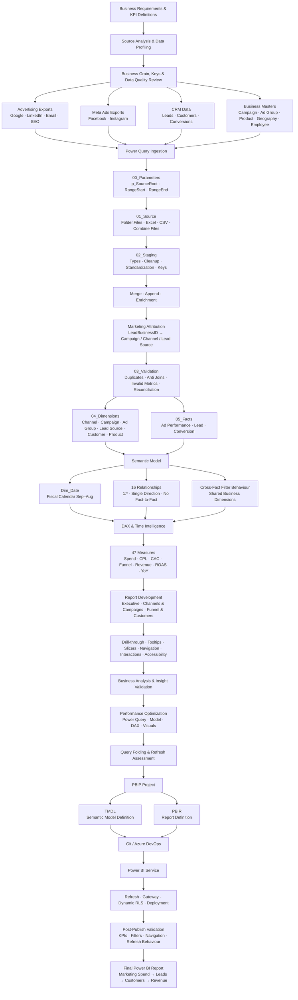
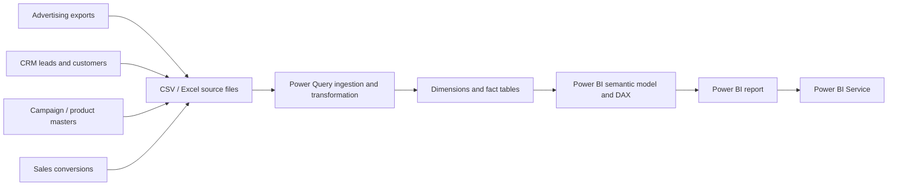
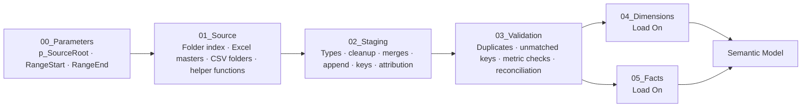

# Marketing ROI & Funnel Analytics | Power BI

A Power BI marketing analytics project that connects advertising performance, CRM leads, customer information and sales conversions into one reporting model so marketing activity can be followed from spend through to revenue.

The project is built around one business question:

> **Is marketing spend actually producing quality leads, customers and revenue?**

Rather than evaluating marketing only through impressions, clicks or lead volume, the report connects those activities with downstream outcomes such as **lead quality, customer acquisition, revenue, ROAS, CAC and marketing contribution**.

[](https://app.fabric.microsoft.com/view?r=eyJrIjoiM2I4NjQ3OGUtOWU3OC00NjQ0LWIzMzYtNTdhMGU0ZmI2NzliIiwidCI6ImQ4ZTFiMDVlLTcwYWEtNGVmNy1iODc4LTQ2NmI2ODhmOTUyZiJ9)

**Core stack:** Power BI Desktop · Power Query · DAX · Power BI Service · PBIP (TMDL semantic model + PBIR report) · Git · Azure DevOps

---

## Project Overview

The reporting period covers **September 2023 to August 2026** and follows a September–August fiscal calendar. The dataset represents a B2B SaaS marketing environment across **Google Ads, Facebook, Instagram, LinkedIn, Email and SEO**.

The source layer is intentionally file- and folder-based, using recurring CSV and Excel exports from advertising platforms, CRM, campaign management, customer master data, product data and sales conversions. Power Query is responsible for ingestion, standardisation, merging, attribution, validation and preparation before the data reaches the semantic model.

The analytical model uses three fact tables because marketing spend, leads and revenue exist at different business grains. Shared dimensions allow valid cross-fact analysis across common business entities without flattening everything into one table.

At the current project scale, the solution contains approximately:

- **437K+ source rows** across all files
- **360,000 advertising-performance rows**
- **48,000 CRM leads**
- **6,000 sales conversions / orders**
- **7,500 customers**
- **240 campaigns**
- **720 ad groups**
- **24 products**
- **122 valid geography combinations across 10 countries**
- **7 dimensions + 3 fact tables**
- **16 active one-to-many relationships**
- **47 DAX measures**
- **3 main report pages + 2 drill-through pages + 1 tooltip page**

Across the complete reporting period, the model records **$97.4M in marketing spend and $150.9M in net revenue**, resulting in an overall **1.55x ROAS** and approximately **$53.6M in marketing contribution** before other operating costs.

---

## End-to-End Project Workflow

The project was developed from the business requirement through to the published Power BI report, with each stage building on the previous one rather than starting directly with visuals.



### 1. Requirements and KPI definition

The work started by defining the business question, reporting period and measures needed to evaluate marketing from spend through to revenue. ROAS, CAC, CPL, qualification rate, conversion rate, marketing contribution and Average Order Value were defined before the report layout was built. The September–August fiscal calendar was also fixed at this stage so the model and time-intelligence logic used one reporting definition throughout.

### 2. Source profiling and grain

The advertising exports, CRM leads, customer files, campaign and ad-group masters, product data and sales conversions were reviewed separately to understand their keys, row grain and relationship to the marketing funnel. This led to three fact tables rather than one flattened dataset: ad performance at channel/campaign/ad-group/day grain, leads at one row per lead, and conversions at one row per order.

### 3. Source-folder design and parameters

The input structure was organised into predictable folders for reference data, campaign setup, advertising exports, CRM extracts, product data and conversions. `p_SourceRoot` was created so all source paths are controlled from one parameter. `RangeStart` and `RangeEnd` were added to support date-boundary filtering for incremental refresh.

### 4. File ingestion and Combine Files

`Folder.Files(p_SourceRoot)` is used as the central file index. Excel files are used for reference/master data, while recurring CSV files are combined for advertising, leads and conversions. Folder Combine and Transform Sample File logic allow new files with the expected schema to be picked up during refresh without rebuilding the query.

### 5. Staging and standardisation

The staging layer handles data types, text cleanup, null handling, column standardisation, key preparation and source-specific transformations. Large platform identifiers are kept as text where numeric conversion could lose precision, while analytical relationship keys are aligned to consistent types before loading to the model.

### 6. Merge, append and enrichment

Campaign data is enriched with employee and geography attributes. Customer master, profile, address and geography data are merged into a reporting-ready customer dimension. Core advertising exports and Meta exports are standardised separately and then appended before Channel, Campaign, Ad Group and Product keys are added.

### 7. Marketing attribution

Conversions are linked back to their originating CRM lead through `LeadBusinessID`. Campaign, Channel and Lead Source are then carried from the source lead into the conversion fact. This creates the documented last-touch attribution path used to connect downstream revenue with the marketing activity that generated the lead.

### 8. Data-quality validation

Separate `val_*` queries check duplicates, unmatched keys, invalid advertising metrics, geography problems and source reconciliation. Left Anti joins are used for unmatched-record checks so the failing records can be inspected directly. Validation queries remain Load Off and are expected to return zero invalid rows when the transformation pipeline is clean.

### 9. Final dimensions and facts

Only reporting-ready dimensions and fact tables are loaded into the semantic model. Source, helper, staging and validation queries remain Load Off. The final model contains seven business dimensions and three facts, with `Dim_Date` created inside the semantic model.

### 10. Semantic-model design

The model was built as a star / galaxy schema with **16 active one-to-many, single-direction relationships** and no direct fact-to-fact relationships. Shared dimensions control cross-fact analysis, while technical keys and helper fields that are not useful to report authors are hidden.

### 11. Date model and fiscal calendar

`Dim_Date` covers the full reporting window and includes fiscal year, fiscal quarter, fiscal month and sort columns. It is marked as the model Date table so time intelligence is based on one controlled calendar rather than hidden auto-date tables.

### 12. DAX and reusable business logic

The project contains **47 DAX measures** organised in a dedicated `_Measures` table. Measures cover Spend & Volume, Cost Efficiency, Funnel & Conversion, Revenue & ROI, prior-year comparisons, YoY change and KPI context. `DIVIDE()`, `SAMEPERIODLASTYEAR()`, `HASONEVALUE()`, `SELECTEDVALUE()` and `SWITCH()` are used where they fit the calculation pattern.

### 13. Report design and interaction logic

The report was built after the model and measures were stable. The three main pages cover Executive Overview, Channels & Campaigns, and Funnel & Customers, supported by Campaign Detail, Customer Detail and a report-page tooltip. Synced slicers, drill-through, navigation, conditional formatting and edited interactions are used where the model grain supports them.

### 14. Troubleshooting during development

Issues found during development were fixed at the appropriate layer instead of being hidden in visuals. These included hard-coded path failures, approximately **144,000 Meta rows** losing campaign attribution because long IDs were treated numerically, a conversion-date key type mismatch that affected date filtering, malformed IDs, PBIP/TMDL editing conflicts and a visual type that did not render reliably in the Desktop version used for the project.

### 15. Performance and model optimization

Optimization was handled across Power Query, the semantic model, DAX and the report. Non-model query layers remain Load Off, unnecessary fields are removed or hidden, relationships remain one-to-many and single-direction, calculations are centralized as measures, visual density is controlled, and Performance Analyzer is used to inspect slow visuals or expensive query behavior during tuning.

### 16. Validation and reconciliation

The completed model is reconciled against the project baseline: **360,000 ad rows, 48,000 leads, 22,367 qualified leads, 6,000 orders, 4,202 distinct customers, $97.36M spend and $150.94M net revenue**. Fiscal-year splits, ratios, slicers, drill-through, tooltips, interactions and formatting are also checked before publishing.

### 17. PBIP project structure

The solution is maintained as a **Power BI Project (PBIP)**. The semantic model is stored through **TMDL** definitions and the report through **PBIR** definitions, which makes model and report changes easier to inspect as project files instead of relying only on a single binary PBIX file.

### 18. Git and Azure DevOps

The PBIP project is tracked with Git and stored in Azure DevOps / Azure Repos. This provides version history for model and report changes and makes it possible to compare measures, relationships, metadata and report definitions between revisions. Local cache files and machine-specific settings remain outside source control.

### 19. Power BI Service publishing

After Desktop validation, the report and semantic model are published to Power BI Service. The same core checks are repeated after publishing: KPI values, navigation, slicers, drill-through, tooltips, fiscal-year filtering, connection settings and refresh behavior.

### 20. Dynamic RLS

Dynamic RLS is covered through `USERPRINCIPALNAME()` and a user-access mapping pattern. The main modeling requirement is that the security filter reaches the intended dimensions and facts through the existing relationship structure. Role behavior is checked using **View As / Other user** when authenticated user-level access is required.

### 21. Incremental and scheduled refresh

All three fact pipelines apply `RangeStart` / `RangeEnd` date filters. Because the current source is file-based, the date filters do not fold back to a database engine, so the source type remains an important refresh-performance consideration. Power BI Service refresh setup also includes credentials, gateway requirements for local/network files, refresh history and failure troubleshooting.

### 22. Deployment workflow

The project also covers the use of deployment pipelines when the same Power BI content needs to move through separate workspaces. Before moving a change forward, the semantic model, refresh behavior, KPI baseline, RLS logic, interactions and report responsiveness are checked again. Deployment rules can be used when parameters or connections differ between workspace stages.

### 23. Final report

The final result is a published Power BI report that connects the complete analytical path from **marketing activity → lead generation → lead quality → customer conversion → revenue**, while keeping the development process traceable from source preparation through semantic modeling, report design, validation, source control and Service delivery.

---

## Business Problem

Marketing data normally arrives from different systems and each system answers only part of the story. Advertising platforms show spend, impressions and clicks. CRM data shows leads and qualification. Sales systems show customers, orders and revenue.

The reporting challenge was to connect those layers so the same report could answer questions such as:

- How much did we spend and how much revenue came back?
- Is marketing return improving over time?
- Which channels are earning back their spend?
- Which campaigns should be scaled, reviewed or stopped?
- Are low-cost leads actually high-quality leads?
- Where are leads dropping out of the funnel?
- Which customer segments, geographies and products contribute most revenue?
- How does CAC vary by channel?
- How should Email and SEO be evaluated when direct media spend is zero or very low?

The reporting funnel is therefore treated as one connected analytical path:

```text
Spend → Impressions → Clicks → Leads → Qualified Leads → Converted Leads → Customers / Orders → Net Revenue
```

The stages are intentionally kept separate in the model because media activity, CRM progression and sales outcomes come from different source systems and operate at different grains.

A few KPI definitions were fixed early so the same business logic is reused across the report:

- **ROAS** = Net Revenue / Marketing Spend
- **CAC** = Marketing Spend / Distinct Customers
- **CPL** = Marketing Spend / Leads
- **Cost per Qualified Lead** = Marketing Spend / Qualified Leads
- **Lead Qualification Rate** = Qualified Leads / Leads
- **Qualified → Converted Rate** = Converted Leads / Qualified Leads
- **Marketing Contribution** = Net Revenue − Marketing Spend
- **Average Order Value** = Net Revenue / Orders

The project uses **last-touch attribution through the originating lead**. Orders do not directly contain campaign attribution, so each conversion is linked back to its source lead and inherits the corresponding campaign, channel and lead-source keys. This rule is documented because first-touch or multi-touch attribution would produce a different channel view.

---

## Solution Architecture



The solution keeps each responsibility in the layer where it belongs. Power Query handles structural preparation and attribution, the semantic model controls relationships and reusable business logic, and the report layer focuses on analysis and interaction. Power BI Service then handles publishing, refresh configuration, security checks and report access.

---

## Source Data

The project uses a structured source-folder contract rather than one pre-built reporting file.

```text
Marketing_ROI_Source_Data/
│
├── 01_Marketing_Reference_Data/
│   ├── Channel_Master.xlsx
│   ├── Lead_Source_Lookup.xlsx
│   ├── Geography_Lookup.xlsx
│   └── Employee_Master.xlsx
│
├── 02_Campaign_Management_System/
│   └── Campaign_Master.xlsx
│
├── 03_Advertising_Platform_Setup/
│   └── Ad_Group_Master.xlsx
│
├── 04_Google_LinkedIn_Email_SEO_Exports/
│   ├── Ad_Performance_2023.csv
│   ├── Ad_Performance_2024.csv
│   ├── Ad_Performance_2025.csv
│   └── Ad_Performance_2026.csv
│
├── 05_Meta_Ads_Exports/
│   ├── Meta_Ads_2023_09.csv
│   ├── ...
│   └── Meta_Ads_2026_08.csv
│
├── 06_CRM_Customer_Exports/
│   ├── Customer_Master.xlsx
│   ├── Customer_Profile.xlsx
│   └── Customer_Address.xlsx
│
├── 07_CRM_Lead_Exports/
│   ├── Leads_2023.csv
│   ├── Leads_2024.csv
│   ├── Leads_2025.csv
│   └── Leads_2026.csv
│
├── 08_Product_Master_Data/
│   └── Product_Master.xlsx
│
└── 09_Sales_Conversion_Exports/
    ├── Conversions_2023.csv
    ├── Conversions_2024.csv
    ├── Conversions_2025.csv
    └── Conversions_2026.csv
```

The different file patterns are intentional. Master/reference data is maintained in Excel, while transactional data is delivered as recurring CSV exports. Google, LinkedIn, Email and SEO files are yearly while Meta files are monthly. That makes the project a realistic Power Query ingestion problem rather than a single clean source table.


---

## Power Query

Power Query is the main data-preparation layer in this project. The source files arrive in different shapes and frequencies, so the query layer is organised into clear groups rather than building one long transformation chain.



Only the final dimensions and facts are loaded to the model. Parameters, source, staging, helper and validation queries remain **Load Off**, which keeps the semantic model focused on analytical tables rather than transformation plumbing.

### Power Query transformation structure

```text
00_Parameters  [Load Off]
├── p_SourceRoot        → one configurable root path for all source folders
├── RangeStart          → incremental-refresh lower boundary
└── RangeEnd            → incremental-refresh upper boundary

01_Source  [Load Off]
├── srcFile_BusinessFilesIndex = Folder.Files(p_SourceRoot)
├── Reference / master sources
│   ├── Channel and lead-source lookups
│   ├── Geography and employee reference data
│   ├── src_Campaign
│   ├── src_AdGroup
│   ├── Customer master / profile / address
│   └── Product master
├── Recurring transaction sources
│   ├── src_CoreAdFiles       → Google / LinkedIn / Email / SEO yearly CSVs
│   ├── src_MetaAdFiles       → Facebook / Instagram monthly CSVs
│   ├── src_LeadFiles         → CRM lead yearly CSVs
│   └── src_ConversionFiles   → sales-conversion yearly CSVs
└── Transform-Sample-File / helper functions for folder combine

02_Staging  [Load Off]
├── stg_Channel / stg_Product / stg_LeadSource
│   └── trim text · standardise types · create analytical keys
├── stg_Geography / stg_Employee / stg_AdGroup
│   └── clean reference attributes · preserve business identifiers
├── stg_Campaign
│   └── Campaign + Employee + Geography → owner / team / region enrichment
├── stg_Customer
│   └── Customer Master + Profile + Address + Geography → reporting-ready customer
├── stg_CoreAds / stg_MetaAds
│   └── standardise source-specific columns and data types
├── stg_AdPerformance
│   └── Core Ads + Meta Ads → append → merge Channel / Campaign / AdGroup / Product keys
├── stg_Lead
│   └── merge Campaign / Channel / Product / LeadSource / Geography → build LeadCreatedDateKey
└── stg_Conversion
    └── Conversion + originating Lead → last-touch Campaign / Channel / LeadSource attribution
       + build ConversionDateKey

03_Validation  [Load Off]
├── val_Channel_Duplicates
├── val_Campaign_Unmatched
├── val_AdGroup_Unmatched
├── val_Customer_Unmatched
├── val_Lead_Unmatched
├── val_Conversion_Unmatched
├── val_Ads_InvalidMetrics
├── val_InvalidGeography
└── val_Source_Reconciliation

04_Dimensions  [Load On]
├── Dim_Channel
├── Dim_Campaign
├── Dim_AdGroup
├── Dim_LeadSource
├── Dim_Customer
└── Dim_Product

05_Facts  [Load On]
├── Fact_AdPerformance
├── Fact_Lead
└── Fact_Conversion

Dim_Date is created in DAX inside the semantic model, not in Power Query.
```

### Folder ingestion

A central `Folder.Files(p_SourceRoot)` index is used as the entry point instead of hard-coding full paths in multiple queries. Recurring transactional folders use the folder-combine / Transform Sample File pattern so newly delivered monthly or yearly files can be picked up on refresh as long as they follow the expected schema.

Hidden or temporary files are excluded before expansion, and data types are applied deliberately after the files are combined. This is important because the same field can otherwise be inferred differently across files.

### Standardisation and data preparation

The staging layer performs the repeatable row-level work before the semantic model is built:

- explicit data-type assignment
- text trimming and cleanup
- blank / null handling
- business-key validation
- surrogate and date-key creation
- Merge / Expand operations
- Append operations
- campaign-owner enrichment
- customer-profile and geography enrichment
- product, channel and lead-source mapping
- defensive ID parsing with `try … otherwise null`
- `RangeStart` / `RangeEnd` filtering on all three fact pipelines

Large platform identifiers are kept as **text** where numeric conversion could lose precision. Relationship and date keys used by the model are standardised to compatible data types before load.

### Attribution logic

A conversion record does not directly contain every marketing attribute needed for ROI analysis. The conversion pipeline therefore links each order back to its originating CRM lead using `LeadBusinessID` and carries the relevant Campaign, Channel and Lead Source keys into `Fact_Conversion`.

```text
Sales Conversion + Source Lead → Campaign / Channel / Lead Source attribution → Fact_Conversion
```

This is the project's documented **last-touch attribution** rule and is what allows revenue to be analysed against the marketing activity that generated the lead.

### Validation before load

Validation is built into the transformation layer rather than being left only to visual inspection. Duplicate checks, Left Anti joins, invalid-metric checks and source reconciliation are kept as separate `val_*` queries. These should return zero invalid rows for a clean refresh.

The most important Power Query outputs can be summarised as:

```text
Campaign + Employee + Geography              → Dim_Campaign
Customer + Profile + Address + Geography     → Dim_Customer
Core Ad Exports + Meta Monthly Exports       → Fact_AdPerformance
CRM Lead Files + business lookups            → Fact_Lead
Sales Conversions + lead attribution         → Fact_Conversion
```

---

## Query Folding and Incremental Refresh

The project uses CSV and Excel files through `Folder.Files`, so this source behaves differently from a SQL database. There is no server-side query engine behind the files for Power Query to push transformations back to.

```text
CSV / Excel files → Folder.Files → Power Query Mashup Engine → transformations and date filtering → model partitions
```

That is why **query folding is not available in the same way it would be with SQL Server or another database-backed source**. The transformations execute in the Power Query engine after the files are read.

`RangeStart` and `RangeEnd` are still applied to the fact pipelines using the standard partition boundary pattern:

```text
Fact_AdPerformance.ReportDate  :  >= RangeStart and < RangeEnd
Fact_Lead.LeadCreatedDate      :  >= RangeStart and < RangeEnd
Fact_Conversion.ConversionDate :  >= RangeStart and < RangeEnd
```

This prepares the model for incremental-refresh partitioning, but it does **not** make the file source fold. Power Query may still need to open the relevant files before rows outside the partition window are removed. In other words, incremental refresh can reduce what is processed into model partitions, but the source-reading cost is not eliminated as efficiently as it would be with a foldable database source.

If the same model is moved to SQL Server, a Fabric Warehouse/Lakehouse SQL endpoint or another foldable source, the semantic-model and report logic can remain largely unchanged while the date filters can be pushed closer to the source for more efficient refresh processing.

---

## Development Issues Resolved

Several issues surfaced during development and became part of the final project design.

### Source-path failures

Early queries depended on local paths, which made refresh fragile when files moved. The source location was moved into `p_SourceRoot`, so individual queries no longer need to be rewritten when the project moves between folders or environments.

### Meta campaign IDs and lost attribution

Approximately **144,000 Meta advertising rows** initially produced null campaign mappings. The external campaign identifier was an 18-digit value and had been interpreted numerically, which caused precision/truncation problems.

The identifier was changed to **text** from ingestion through the merge. This restored the campaign mapping across the Meta dataset and prevented a large block of spend from becoming unattributed.

### Revenue not filtering correctly by date

`Fact_Conversion[ConversionDateKey]` was initially text while `Dim_Date[DateKey]` was numeric. The mismatch prevented the expected date-filter behaviour.

The conversion date key was rebuilt as `Int64.Type` and the model column type was aligned with the date dimension. After the fix, revenue split correctly by fiscal year and the time-intelligence measures behaved as expected.

### Malformed identifiers

Some ID parsing logic was hardened with `try … otherwise null`. A malformed source value can now be isolated through validation instead of failing the complete refresh.

### PBIP / TMDL editing

Direct semantic-model file edits are made only when Power BI Desktop is fully closed. Reopening, refreshing and validating after the edit became part of the project workflow because Desktop can otherwise hold its own in-memory project state while files are being changed externally.

### Visual rendering

A planned plain line-chart implementation did not render reliably in the Desktop version used during development. The final report uses combo/column alternatives where necessary so the analytical message renders reliably in the Power BI Desktop version used for the project rather than following the original wireframe blindly.

---

## Data Model

The semantic model follows a **star / galaxy schema** with three fact tables sharing conformed dimensions.

```text
                         Dim_Date
                            │
            ┌───────────────┼───────────────┐
            │               │               │
            ▼               ▼               ▼
 Fact_AdPerformance     Fact_Lead     Fact_Conversion
            ▲               ▲               ▲
            │               │               │
     Shared business dimensions
```

### Dimensions

- `Dim_Date`
- `Dim_Channel`
- `Dim_Campaign`
- `Dim_AdGroup`
- `Dim_LeadSource`
- `Dim_Customer`
- `Dim_Product`

### Facts

- `Fact_AdPerformance` — one row per channel × campaign × ad group × day
- `Fact_Lead` — one row per CRM lead
- `Fact_Conversion` — one row per order / conversion

### Supporting objects

- `_Measures` — dedicated DAX measure table
- `Funnel Stage` — disconnected helper table used for the Leads → Qualified → Converted funnel

The model contains **16 active relationships**. All analytical relationships are **Dimension (1) → Fact (*)** and use single-direction filtering. There are no direct fact-to-fact relationships.

This keeps filter propagation predictable and avoids using bi-directional filtering as a shortcut for modelling problems.

---

## Cross-Fact Analysis

The main KPIs do not live in one fact table:

```text
Spend / Impressions / Clicks → Fact_AdPerformance
Leads / Qualification        → Fact_Lead
Customers / Revenue          → Fact_Conversion
```

As a result, ROAS, CPL, CAC and Marketing Contribution are only valid when the selected dimension can reach the facts required by the calculation.

The shared analytical dimensions used for cross-fact ratios are primarily:

- Date
- Channel
- Campaign
- Product

Other dimensions are intentionally narrower:

- **AdGroup** filters advertising performance only.
- **LeadSource** applies to lead and conversion analysis but not advertising spend.
- **Customer** applies to conversion/revenue analysis, not the advertising or lead facts.

This rule is also reflected in visual interactions. Customer-level visuals do not filter the lead funnel because customer attributes do not have a valid relationship path to `Fact_Lead`. Allowing that interaction would make the page look interactive while producing analytically misleading results.

---

## Date Model

`Dim_Date` is created in the semantic model and covers **1,096 dates from 1 September 2023 to 31 August 2026**.

The business reports on a September–August fiscal year, so fiscal attributes are built directly into the date dimension:

```text
FY24 = Sep 2023 – Aug 2024
FY25 = Sep 2024 – Aug 2025
FY26 = Sep 2025 – Aug 2026
```

The table includes standard calendar fields along with fiscal year, fiscal quarter, fiscal month number and sort columns. It is marked as the model Date table so time-intelligence logic is based on one controlled calendar rather than hidden auto-date tables.

The fiscal calendar matters because calendar-year 2023 and 2026 are partial periods in the dataset. Comparing full fiscal years gives a more meaningful business trend.

---

## DAX & KPI Design

The semantic model contains **47 reusable DAX measures** in `_Measures`, organised into business-focused display folders.

### Spend and volume

- Total Spend
- Total Impressions
- Total Clicks
- Total Reach

### Cost efficiency

- CTR %
- CPC
- CPM
- CPL
- CAC
- Cost per Qualified Lead

### Funnel and conversion

- Total Leads
- Qualified Leads
- Converted Leads
- Total Customers
- Lead Qualification Rate
- Qualified → Converted Rate
- Lead → Customer Rate
- Click → Lead Rate
- Funnel Value
- Funnel % of Leads

### Revenue and return

- Total Orders
- Gross Revenue
- Net Revenue
- Total Refunds
- ROAS
- Average Order Value
- Average Revenue per Customer
- Marketing Contribution

### Time comparison

- prior-year Spend
- prior-year Revenue
- prior-year Leads
- prior-year Customers
- prior-year ROAS
- prior-year CAC
- YoY percentage measures
- ROAS YoY change

### KPI context

KPI cards dynamically show context such as:

```text
▲ 4.2% vs prior FY
▼ 3.1% vs prior FY
No prior year
All fiscal years
```

The measure layer uses patterns such as `DIVIDE()`, `SAMEPERIODLASTYEAR()`, `HASONEVALUE()`, `SELECTEDVALUE()` and `SWITCH()` so ratio handling, fiscal comparisons and disconnected helper logic remain reusable across visuals.

---

## Report Design

The report is designed for two levels of use: leadership should be able to understand the headline position quickly, while analysts and campaign managers can drill into the drivers behind it.

The visual design uses a simple **Corporate Cool** system:

- cool-grey report surface
- white cards
- slate typography
- cyan for revenue / return measures
- slate for spend / cost measures
- fixed channel colours
- consistent spacing and navigation
- accessible contrast
- alt text and readable labels

A consistent visual rule is used throughout the report:

> **Cyan = money back. Slate = money out.**

This makes the relationship between spend and return easier to read across KPI cards, charts and tables.

---

## Report Pages

### Executive Overview

The landing page answers the main business question first: what was spent, what came back and whether performance is improving.

It includes:

- Total Spend
- Net Revenue
- ROAS
- Leads
- Customers
- CAC
- prior-fiscal-year KPI context
- monthly Spend vs Net Revenue
- channel-level Spend vs Net Revenue
- Fiscal Year and Channel slicers

### Channels & Campaigns

This page moves from overall performance into allocation and campaign-level efficiency.

It includes:

- Marketing Contribution by Channel
- campaign Spend vs Revenue analysis
- monthly channel trends
- ad-format CTR / CPC analysis
- campaign leaderboard
- CPL, CAC, Customers, Revenue and ROAS
- drill-through into individual campaigns

### Funnel & Customers

This page focuses on what happens after marketing generates demand.

It includes:

- Leads → Qualified → Converted funnel
- qualification vs conversion by channel
- customer-segment revenue
- country-level revenue
- product-category performance
- top-customer analysis
- customer drill-through

### Campaign Detail

A hidden drill-through page provides one-campaign context including campaign profile, Spend, Revenue, ROAS, Leads, CPL, CAC, monthly trend, campaign funnel and ad-group performance.

### Customer Detail

A second hidden drill-through page provides customer profile, Orders, Revenue, AOV, Refunds, monthly revenue and order history.

### Channel Tooltip

A report-page tooltip provides channel-level Spend, Revenue, ROAS, CAC and trend context without forcing users away from the main page.

---

## Key Results

Across the full reporting period:

- **Total Spend:** $97.36M
- **Net Revenue:** $150.94M
- **Gross Revenue:** $154.89M
- **ROAS:** 1.55x
- **Marketing Contribution:** +$53.58M
- **Leads:** 48,000
- **Qualified Leads:** 22,367 / 46.6%
- **Converted Leads / Orders:** 6,000 (12.5% of leads)
- **Distinct Customers:** 4,202 (8.8% of leads)

The overall 1.55x ROAS hides very different channel economics. Email, LinkedIn and SEO together contribute approximately **+$86.1M**, while Google Ads, Instagram and Facebook together contribute approximately **−$32.5M** after media spend.

Google Ads accounts for roughly **51% of total spend** in the project dataset but returns around **0.73x ROAS**, making campaign-level optimisation inside Google one of the clearest areas for investigation.

LinkedIn tells a different story. Its lead costs are relatively high, but the enterprise-heavy customer mix produces much higher revenue per customer and an overall ROAS of approximately **3.22x**. This is one reason the report does not use CPL alone to judge channel quality.

Facebook generates a large volume of leads at a relatively low paid CPL, but qualification is weaker. Instagram shows an even weaker bottom-funnel pattern. The report therefore keeps qualification and conversion rates next to lead counts rather than treating raw lead volume as success.

From FY25 to FY26, the project dataset shows approximately **7% growth in customers** alongside an **8% reduction in CAC**, while spend decreased slightly.

At campaign level, **127 of the 199 campaigns with media spend (about 64%)** returned less than $1 for each $1 spent. This illustrates why a positive overall ROAS still requires campaign-level investigation.

---

## Data Validation

The model is reconciled against a known validation baseline after refresh. Core checks include:

- **360,000** advertising rows
- **$97,364,735** Total Spend
- **2,726,971,427** Impressions
- **65,296,970** Clicks
- **48,000** Leads
- **22,367** Qualified Leads
- **6,000** Orders
- **4,202** Distinct Customers
- **$154,885,248** Gross Revenue
- **$150,944,966** Net Revenue
- **1,096** Date rows

Validation also covers:

- duplicate and unmatched keys
- relationship behaviour
- fiscal-year splits
- manual ratio spot checks
- slicer behaviour
- drill-through context
- tooltip context
- edited visual interactions
- sort order and formatting

One business-definition question remains visible in the documentation: `ConversionStatus` contains Completed, Refunded, Pending and Cancelled orders. The current baseline includes all rows. If the business definition changes to recognised revenue from Completed orders only, the revenue measures should be changed explicitly rather than silently changing the validation baseline.

---

## Performance & Optimization

Performance work is considered across Power Query, the semantic model, DAX and the report rather than being treated as one final tuning step.

### Power Query

- source, staging and validation queries remain **Load Off**
- one reusable root-folder index is used for source discovery
- relationship keys are cleaned before merges
- 18-digit external identifiers remain text where numeric precision is unsafe
- integer surrogate/date keys are used for model relationships
- transformations are layered to make refresh issues easier to isolate
- `RangeStart` / `RangeEnd` filters exist on all three fact tables

### Semantic model

- clean fact/dimension separation
- one-to-many relationships
- single-direction filter flow
- no direct fact-to-fact relationships
- no unnecessary many-to-many relationships
- no unnecessary bi-directional filters
- technical fields hidden from report authors
- reusable calculations centralised in `_Measures`

### DAX

- reusable measures instead of visual-specific duplicate calculations
- `DIVIDE()` for safe ratios
- context checks for YoY logic
- dedicated date dimension for time intelligence
- disconnected helper table for funnel presentation instead of an unnecessary relationship

### Report layer

- controlled visual density
- drill-through instead of overcrowding the main analytical pages
- report-page tooltips for secondary context
- edited interactions where the model grain does not support cross-filtering
- Performance Analyzer used as the main approach for identifying slow visuals or expensive measure execution during tuning

The measurable engineering improvements in the project include restoring campaign attribution across **144,000 Meta rows**, centralising **47 reusable measures**, governing **16 relationships**, reconciling **360K ad rows + 48K leads + 6K orders**, and keeping source, staging and validation queries outside the loaded semantic model.

---

## Power BI Project Format

The solution is maintained as a **Power BI Project (PBIP)** rather than relying only on a binary `.pbix` file.

```text
Marketing ROI & Funnel Analytics.pbip
│
├── Marketing ROI & Funnel Analytics.Report/
│   └── PBIR report definitions
│
└── Marketing ROI & Funnel Analytics.SemanticModel/
    └── TMDL semantic-model definitions
```

### PBIP

PBIP provides a project-based structure where the report and semantic model remain separate but connected. This makes the project easier to manage in Git and avoids the traditional pattern of manually renamed PBIX versions.

### TMDL

TMDL stores semantic-model definitions such as tables, columns, measures, relationships, formats, descriptions, metadata and Power Query expressions in text-based files that can be reviewed and compared in source control.

### PBIR

PBIR stores report definitions in a source-control-friendly structure so report-page and visual changes can be versioned rather than existing only inside a PBIX binary.

---

## Source Control & Azure DevOps

The project is maintained in **PBIP** format so the semantic model and report definitions can be stored as text-based project files rather than keeping the complete development history inside one binary PBIX file.

```text
Power BI Desktop → PBIP / TMDL / PBIR → Git → Azure DevOps Repos → change history / review / rollback
```

Git is used to track changes across the Power BI project, while Azure DevOps provides the remote repository for keeping the project history in one place. This is especially useful with TMDL and PBIR because changes to measures, relationships, model metadata and report definitions can be compared at file level.

The source-control setup focuses on normal Power BI development tasks:

- saving the report as a Power BI Project rather than only as PBIX;
- keeping the `.Report` and `.SemanticModel` folders together with the `.pbip` file;
- tracking DAX, relationships, formatting and report-definition changes through Git;
- reviewing file differences before replacing a working model or report version;
- keeping source data, local cache files and machine-specific settings outside Git through `.gitignore`;
- using commit history to understand what changed and to return to an earlier working state when required.

PBIP also changes how I work with the model locally. When TMDL or Power Query expressions are edited outside Desktop, Power BI Desktop is closed first, then the project is reopened, refreshed and validated. This avoids conflicting in-memory and file-based model states.

The main value of source control in this project is simple: report development becomes traceable. Instead of files such as `Final.pbix`, `Final_v2.pbix` and `Final_latest.pbix`, changes to the model and report can be followed through the project history.

---

## Power BI Service, Security & Publishing

After the report was completed and validated in Power BI Desktop, the report and semantic model were published to **Power BI Service**. After publishing, the main report behaviour was checked again, including navigation, slicers, drill-through, tooltips, fiscal-year filtering, headline KPI values, connection settings and refresh behaviour.

### Dynamic Row-Level Security

Dynamic RLS is covered as part of the semantic-model security design. The pattern uses `USERPRINCIPALNAME()` together with a user-access mapping structure so one report can return different data scopes based on the signed-in user instead of creating separate copies of the report.

The important part from a modelling perspective is where the security filter is applied and whether that filter reaches the required fact tables correctly. The same relationship and filter-propagation rules used for normal analysis also matter for RLS. Role behaviour is checked with **View As / Other user** so allowed and restricted scopes can be tested before the report is shared with authenticated users.

Dynamic RLS is relevant when the report is shared through authenticated user access. The security design is kept separate from the general share link so the same semantic-model pattern can be used when user-specific access is required.

### Incremental refresh

`RangeStart` and `RangeEnd` are included in Power Query, and all three fact pipelines apply the standard date-boundary pattern. This keeps the fact queries ready for incremental-refresh configuration:

```text
Fact_AdPerformance.ReportDate  : >= RangeStart and < RangeEnd
Fact_Lead.LeadCreatedDate      : >= RangeStart and < RangeEnd
Fact_Conversion.ConversionDate : >= RangeStart and < RangeEnd
```

The project also exposed an important limitation: the source is based on CSV and Excel files through `Folder.Files`, so these date filters do not fold back to a database engine. The files still need to be read before Power Query can remove rows outside the required range. This is why query folding and source type must be considered together with incremental refresh rather than treating the two parameters alone as a performance solution.

### Scheduled refresh and gateway

The Service-side refresh workflow covers the normal items required to keep a published Power BI model current: source credentials, gateway availability for local/on-premises files, refresh schedule, refresh history and failure investigation.

For this source pattern, a gateway is required when the Service must reach files that remain on a local or network location. Common refresh checks include:

- gateway online/offline status;
- source credentials;
- changes to file names or folder paths;
- a new file arriving with a different schema;
- unexpected data-type changes;
- `p_SourceRoot` pointing to the wrong location;
- failures introduced by a transformation or merge.

The same validation baseline used during Desktop development is useful after refresh because a technically successful refresh can still load incorrect business results.

### Deployment pipeline

The project also covers how the same Power BI item can be moved through separate workspaces by using a deployment pipeline. The purpose is to validate report/model changes before updating the version used by report consumers, while deployment rules can handle environment-specific parameters or connections where required.

The checks before moving a change forward are the same checks used throughout this project:

- the semantic model opens and refreshes correctly;
- baseline KPIs reconcile;
- relationships and filter propagation behave correctly;
- RLS logic is checked where authenticated access is used;
- slicers, drill-through, tooltips and navigation still work;
- no model change has introduced unnecessary columns, relationships or calculations;
- report pages remain responsive after the change.

### Report publishing

The completed report is published through Power BI Service and linked directly from the repository. After publishing, the report is checked again for KPI consistency, filters, drill-through, tooltips, navigation and refresh behaviour.

The Service work is part of the same project lifecycle: build and validate locally, publish the semantic model and report, confirm behaviour after publishing, manage refresh requirements, and keep security and deployment considerations aligned with the model design.

---

## Repository Structure

```text
Marketing-ROI-Funnel-Analytics/
│
├── README.md
├── .gitignore
│
├── powerbi/
│   ├── Marketing ROI & Funnel Analytics.pbip
│   ├── Marketing ROI & Funnel Analytics.Report/
│   └── Marketing ROI & Funnel Analytics.SemanticModel/
│
├── docs/
│   ├── requirements.md
│   ├── report-spec.md
│   ├── data-model.md
│   ├── project-guide.md
│   └── images/
│
├── data/
│   └── README.md
│
├── tools/
│   └── build_report.js
│
└── .azuredevops/
    └── pull_request_template.md
```

The `data/README.md` documents the source-folder contract used by `p_SourceRoot`, while the Power BI project files, supporting documentation and build utilities remain organised separately in the repository.

---

## Technology Stack

- **Microsoft Power BI Desktop** — semantic-model and report development
- **Power BI Service** — report publishing, refresh configuration and Service-side validation
- **Power Query / M** — folder ingestion, Combine Files, staging, merges, append, data cleaning, keys, attribution and validation
- **DAX** — KPI measures, ratios, funnel calculations, fiscal time intelligence and KPI context
- **Power BI Semantic Model** — relationships, filter behaviour, measure organisation and model metadata
- **Import mode** — in-memory analytical model over the prepared fact and dimension tables
- **CSV / Excel + Folder connector** — recurring advertising, CRM, master-data and conversion source files
- **Dynamic RLS design** — `USERPRINCIPALNAME()` and user-access mapping pattern
- **Incremental Refresh design** — `RangeStart` / `RangeEnd` filters on all fact pipelines
- **Scheduled Refresh / Gateway workflow** — Service refresh setup and troubleshooting for file-based sources
- **Deployment Pipelines** — moving validated Power BI changes between separate workspaces when required
- **Performance Analyzer** — visual and DAX query investigation during report tuning
- **PBIP (TMDL semantic model + PBIR report)** — project-based Power BI structure used for versionable model and report definitions
- **Git** — local version history and comparison of project changes
- **Azure DevOps / Azure Repos** — remote source control for the Power BI project
- **Node.js** — supporting report-generation utility stored in `tools/build_report.js`

---

## Project Summary

This project brings together the full analytical path from **marketing spend to revenue** in one Power BI solution.

The work covers source profiling, folder-based Power Query ingestion, cleaning and standardisation, last-touch attribution, dimensional modelling, multi-fact filter behaviour, fiscal time intelligence, reusable DAX measures, report design, validation, performance considerations, incremental-refresh design, PBIP/TMDL/PBIR project structure, Git/Azure DevOps source control and the Power BI Service workflow for publishing, refresh, security and deployment.

The final report gives marketing leadership a consolidated view of spend, lead quality, customer acquisition and revenue, while providing campaign managers and analysts enough detail to investigate the drivers behind the headline result.

The project also captures the practical issues that usually sit between the data source and the final dashboard: type mismatches, large external identifiers, broken attribution, date-filter behaviour, refresh limitations, cross-fact context, visual interactions and Service-side checks.

**Live Power BI Report:**  
[View Interactive Dashboard](https://app.fabric.microsoft.com/view?r=eyJrIjoiM2I4NjQ3OGUtOWU3OC00NjQ0LWIzMzYtNTdhMGU0ZmI2NzliIiwidCI6ImQ4ZTFiMDVlLTcwYWEtNGVmNy1iODc4LTQ2NmI2ODhmOTUyZiJ9)
